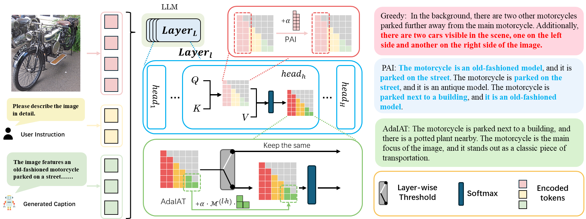
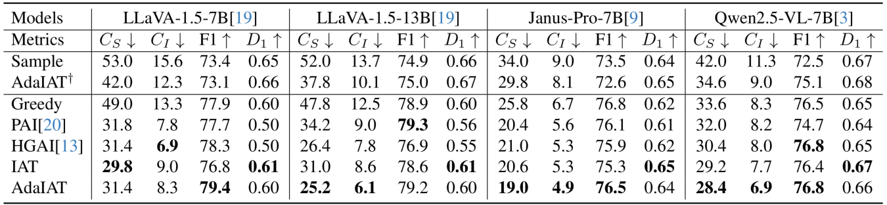

# AdaIAT: Adaptively Increasing Attentions to Generated Text Tokens to Alleviate Hallucinations in Detail Caption (CVPR 2026)


<!-- [](https://arxiv.org/pdf/2311.17911.pdf) -->

## 🎯 Overview
Hallucination issues have become a significant impediment to the development and application of current Large Vision-Language Models (LVLMs), motivating researchers to continuously explore mitigation strategies. One particularly promising approach, attention intervention, significantly reduces hallucination rates at low computational cost by increasing attention to image tokens during inference. However, empirical observations reveal that it may compromise linguistic capabilities, manifesting as repetitive descriptions. To address this, we propose a training-free method named **I**ncrease **A**ttention to **T**ext (IAT). By more effectively leveraging the progressively distilled, compressed caption‐related visual information at each step of the autoregressive generation process, it achieves a substantial reduction in hallucination rate. To prevent naive amplification from impairing the inherent prediction capabilities of LVLMs, we further explore **Ada**ptive IAT (AdaIAT) that employs a layer-wise threshold to control intervention time and fine-grained amplification magnitude tailored to the characteristics of each attention head. Experimental results on several LVLMs show that AdaIAT effectively alleviates hallucination (reducing hallucination rates $C_S$ and $C_I$ on LLaVA-1.5 by 35.8\% and 37.1\%, respectively) while preserving their linguistic performance and prediction capabilities. Compared to other attention intervention methods, AdaIAT achieves a superior trade-off.

_Figure 1. The mechanisms of mitigating hallucination based on Greedy in PAI and AdaIAT, with repeated descriptions annotated in red and hallucinations annotated in blue. While Greedy generates the hallucinated object “cars”, PAI enhances attention to image tokens with a fixed $\alpha$ to mitigate hallucination. However, it suffers from repeated subjects and monotonous, redundant language. In contrast, AdaIAT employs layer-wise thresholds to control the amplification and designs $\mathcal{M}^{(l,h)}$ for each attention head to adaptively enhance attention towards the generated text tokens, which produces accurate and hallucination-free captions._

## ⚙️ Environment Setup
```bash
conda create -n AdaIAT python=3.10
conda activate AdaIAT
cd AdaIAT
pip install -r requirements.txt
```

Since the attention calculation process of AdaIAT requires additional parameters, it is necessary to modify two files in the transformers library: generation/utils.py and models/llama/modeling_llama.py. The modified files are located in transformers/LLaVA in this project and can be used to directly replace the files in the original library. All modifications are marked with the comment `# AdaIAT edited`.


## 🕹️ Evaluation
For CHAIR Evaluation, run:
```bash
cd LLaVA
python chair_generate.py --method AdaIAT --alpha 6 --beta 0.5 --name AdaIAT_6_0.5 --model-path $model --image-folder $dataset
```

The commands for PAI, HGAI, IAT, and AdaIAT in run.sh:
```bash
bash run.sh
```

The generated caption file is stored in result/chair by default, and is then evaluated using chair.py.
```bash
cd ..
python chair.py
```
## 🏅 Experiments

Table 1. CHAIR hallucination evaluation of various methods on three LVLMs. The best values (excluding Greedy) are highlighted in **bold**. ${\dagger}$ indicates that the attention intervention is applied based on the Sample decoding..


<!-- ## 📑 Citation
If you find our project useful, we hope you can star our repo and cite our paper as follows:
```

``` -->